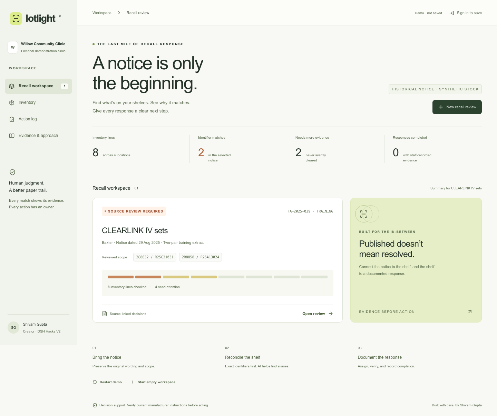
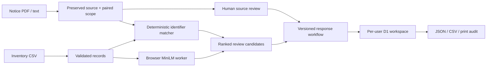

# Lotlight

### A notice is only the beginning.

**A project by Shivam Gupta for DSH Hacks V2.** Evidence-backed medical recall review for independent clinics that keep stock in spreadsheets.



A manufacturer sends a recall letter. A clinic still needs to find the affected stock, resolve missing labels, assign the response, and retain evidence. Lotlight connects those steps in one explainable workflow.

**Status:** functional, tested hackathon MVP. Not a clinically validated, certified, or fully production-approved recall-management system. No clinical outcome claims or real customer validation. The hosted publication initially uses owner-only access; enable public access before sending it to judges.

**Hosted app:** https://lotlight-shivam.sg127977958.chatgpt.site (owner-private until sharing is explicitly enabled).

## Try the story

Open the app, choose **Open review**, then:

1. Inspect eight synthetic inventory lines against two catalog/lot pairs from Baxter's historical **FA-2025-039** notice.
2. Run **local AI** to compare product descriptions. A quantized MiniLM model runs in a browser worker; no API key or inference service is needed.
3. Open **Source & scope**, follow the original manufacturer link, and confirm the training scope. Before this, response actions are blocked.
4. Expand an identifier match and assign a responsible person. Record physical-label verification and response evidence. Partial quantities remain open.
5. Inspect the missing-lot line. It cannot be completed. Correct that inventory line; only its response requires fresh review.
6. Export the JSON audit record, CSV review, or printable report. Source changes and inventory changes retain historical snapshots.

**Demonstration:** fictional Willow Community Clinic, 8 stock lines, 218 units, 4 locations. Two exact identifier pairs represent 36 synthetic units. Two incomplete lines represent 14 units needing information. These are software fixtures, not observed healthcare outcomes. The historical extract is intentionally limited to two pairs, not the complete recall scope.

## Run locally

Node.js 22.13+ and npm are required. No application API keys are required.

```sh
npm ci
npm run build
node --import ./scripts/sites-env.mjs ./node_modules/wrangler/bin/wrangler.js d1 execute DB --local --config dist/server/wrangler.json --persist-to .wrangler/state --file drizzle/0000_real_hellcat.sql
npm run dev
```

Use the URL printed by the dev server (normally port 5173; it selects another if occupied). Apply the migration once per new local database, not on every restart. The development-only sign-in simulates a local user through the starter's loopback auth helper. Hosted sign-in is dispatch-owned ChatGPT authentication. Production build output does not include the development sign-in mock.

```sh
npm test                    # matching, parsing, state transitions, adversarial scope tests
npm run typecheck
LOTLIGHT_TEST_URL=http://localhost:5173 npm run test:e2e
```

For browser tests, run `npx playwright install chromium` once. The E2E server must already be running. The sign-in test resets only the local test user's demo workspace. Never point this suite at a real clinic workspace.

## Implemented capabilities

- CSV import with validation, BOM/quoted-field support, explicit provenance, missing-identifier flags, and duplicate-row rejection.
- Client-side text-based PDF / TXT ingestion and pasted notices. Scanned PDFs require a verified transcription; no OCR is claimed.
- Explicit paired source scope. Supported form: `Catalog: ABC; Lots: 123, 456`. Each scope row must match one complete supporting line. For a table, append a staff-checked labeled transcription to preserved source text. Conditional ranges, exclusions, serial ranges and kit/packaging logic are outside the matcher.
- Case/outer-whitespace normalization while preserving punctuation and leading zeroes. Manufacturer discrepancies stay reviewable when the catalog agrees.
- Browser MiniLM semantic similarity for product aliases, pinned to a model revision. AI ranks candidates only; it never asserts an exact match or approves actions. Identifier matching remains available when the model cannot load.
- Human source approval, owner and due date, verified and completed stages, quantity validation, and required response references.
- Single-line corrections with versioning. Unchanged items retain their actions. Full replacement opens fresh obligations.
- Private per-account Cloudflare D1 storage, server-side authorization and command validation, same-origin writes, and optimistic concurrency.
- Anonymous demo state is explicitly ephemeral, held in memory, and does not transfer on sign-in.
- JSON audit export with SHA-256 checksum, spreadsheet-safe CSV, and print/PDF report. A checksum is not a signature or proof that staff evidence is true.
- Optional WebMCP read-only review tool, with feature detection and schema validation.

## Architecture



The AI model is `Xenova/all-MiniLM-L6-v2`, quantized q8, pinned to revision `751bff37182d3f1213fa05d7196b954e230abad9`. First use downloads about 23 MB of weights plus browser runtime assets. No stock descriptions are sent to an AI provider. Signed-in inventory and notices do go to the app database. See [model card and evaluation](docs/AI-MODEL-CARD.md), [security and limitations](docs/SECURITY.md), and [validation](docs/VALIDATION.md).

Authentication trusts headers injected by the Sites dispatcher. Do not expose this Worker directly or place it behind a proxy that accepts client-supplied `oai-authenticated-user-*` headers. Per-user isolation is implemented; shared clinic roles, email invitations, supplier communications and EHR integrations are not.

## Why this could be a business

Initial buyer hypothesis: independent infusion or ambulatory clinics whose recall reviews still involve manual spreadsheet searches. Enterprise competitors such as ECRI already serve this category. Our proposed wedge is transparent reconciliation, explicit uncertainty, and a low-friction spreadsheet workflow.

Proposed pilot price: **$149/site/month**, unvalidated. At an assumed loaded staff rate of $30/hour, five hours saved monthly equals $150. This is a break-even illustration, not measured savings. Validate time per notice, missed scope pairs, unresolved labels and response completion before making commercial or clinical claims. See [commercial plan](docs/COMMERCIAL-PLAN.md).

## Submission package

- `submission/Lotlight-One-Page.pdf` — required project description.
- `submission/Lotlight-Pitch.pptx` and `.pdf` — editable presentation and rendered copy.
- `submission/VIDEO-SCRIPT.md` — narration to read verbatim and matching shot list.
- `submission/DEVPOST.md` — paste-ready submission text.
- `submission/SUBMISSION-CHECKLIST.md` — remaining human steps and eligibility checks.
- `submission/Lotlight-Source-Code.pdf` — authored source listing in addition to this repository.
- `submission/Lotlight-Demo-Silent.mp4` — recorded 3:05 product walkthrough for your voiceover.

## Credits and evidence

Shivam Gupta is the project creator and submission owner. AI tools assisted research, design, implementation, tests, independent review, and presentation preparation. Human review, final product decisions, any personal modifications and the recorded presentation should be described truthfully at submission. No interviews, deployments in clinics, personal clinical experiences, or measured health outcomes are invented.

Built with React, Vinext, Cloudflare Workers/D1, Radix/Shadcn, Lucide, Zod, PDF.js, Transformers.js and MiniLM. The Sites starter supplies build/auth/UI scaffolding. Original application code is MIT-licensed; dependencies retain their licenses. The model is Apache-2.0. Manufacturer material is linked and minimally quoted; the demo notice is a clearly labeled paraphrased training extract. See [sources](docs/SOURCES.md).
